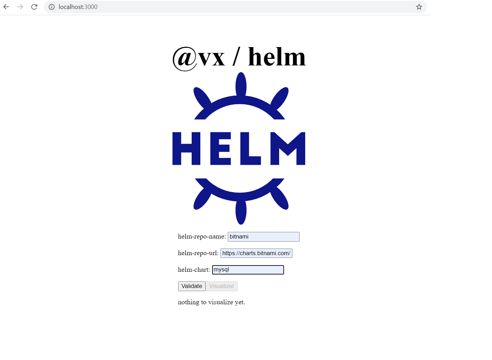
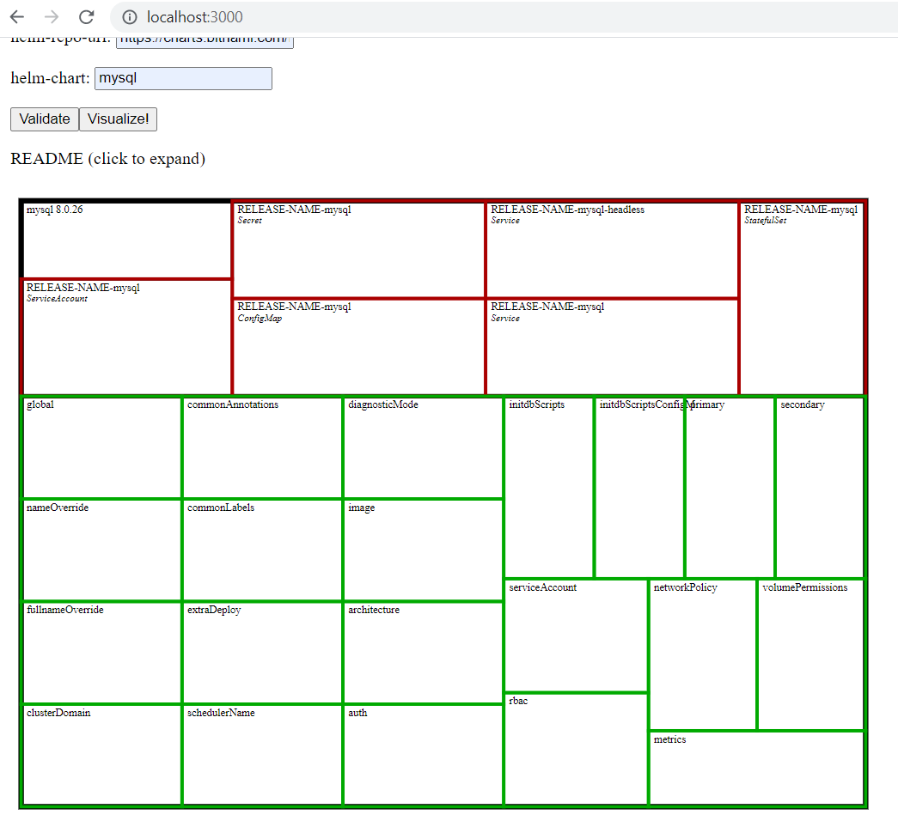

# VX Helm Visualizer

## Getting Started

First, run the development server:

```bash
git clone https://github.com/janesser/vx-helm.git
cd vx-helm
yarn install
yarn dev
```

Open [http://localhost:3000](http://localhost:3000) with your browser to see the result.

Enter some coordinates of the chart in question, i.e. its repo location.

Click validate, the visualize button should unlock.

Browse the details. Click on README to expand and collapse. Click on respective elements for their details.


PRs are welcome anytime.

Enhancements i already figured out (but didn't manage to tackle yet):
- ~~facilitate chart selection once repo is known~~
- nicer details display
- nicer CSS